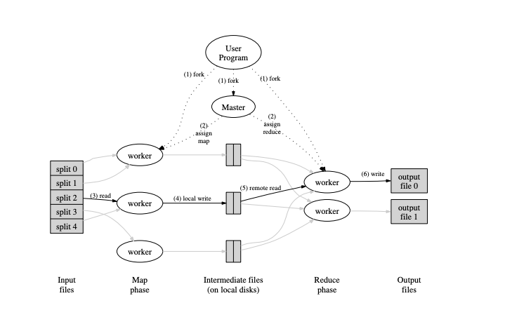

# MapReduce

MapReduce is a programming model and an associated implementation for processing and generating large data sets. Users specify a map function that processes a key/value pair to generate a set of intermediate key/value pairs, and a reduce function that merges all intermediate values associated with the same intermediate key.

a distributed MapReduce, consisting of two programs, the coordinator and the worker. There will be just one coordinator process, and one or more worker processes executing in parallel. The workers will talk to the coordinator via RPC. Each worker process will ask the coordinator for a task, read the task's input from one or more files, execute the task, and write the task's output to one or more files. The coordinator should notice if a worker hasn't completed its task in a reasonable amount of time (use ten seconds), and give the same task to a different worker.

